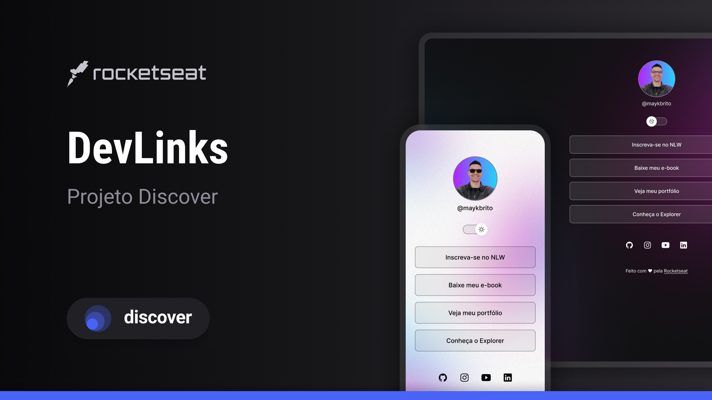

<h1 align="center"> Devlinks </h1>

Programa exclusivo e gratuito, promovido pela Rocketseat para ensino de tecnologias WEB.

  <a href="#-tecnologias">Tecnologias</a>&nbsp;&nbsp;&nbsp;|&nbsp;&nbsp;&nbsp;
  <a href="#-projeto">Projeto</a>&nbsp;&nbsp;&nbsp;|&nbsp;&nbsp;&nbsp;
  <a href="#-layout">Layout</a>&nbsp;&nbsp;&nbsp;|&nbsp;&nbsp;&nbsp;

  

 

Pagina feita baseada na imagem a baixo, com algumas modificações

 

  

## 🚀 Tecnologias

Esse projeto foi desenvolvido com as seguintes tecnologias:

- HTML e CSS
- JavaScript
- Git e Github
- Figma

## 💻 Projeto

Agrupamento de links para contato,donwload de curriculum,links sociais etc

## 🔖 Layout

Você pode visualizar o layout do projeto através [DESSE LINK](https://www.figma.com/file/D79EoldqZkcGUIDPOzAHgd/DevLinks-%E2%80%A2-Projeto-Discover-(Community)?type=design&node-id=1437-191&mode=design&t=0wiBr6dNeKk7C2AR-0). É necessário ter conta no [FIGMA](www.figma.com)# Devlinks
# Devlinks
